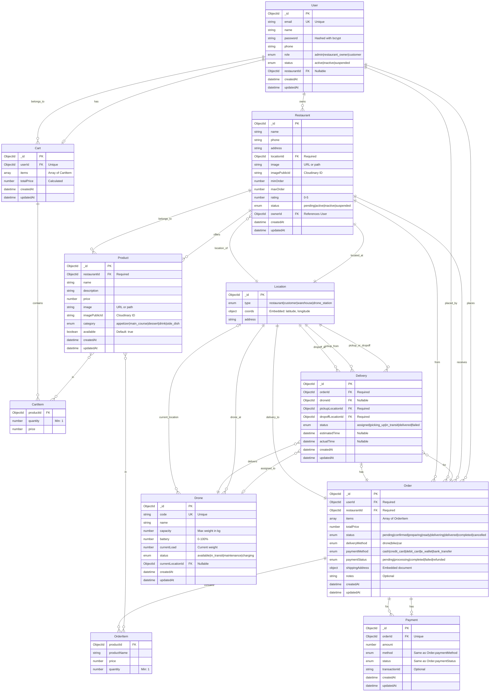

# Entity Relationship Diagram (ERD) - Food Delivery System

## Database Schema



## Relationships Explained

### 1. User Relationships
- **User → Restaurant**: One-to-Many (One user can own multiple restaurants, but typically one)
  - `User.restaurantId` references `Restaurant._id` (when role is `restaurant_owner`)
  - `Restaurant.ownerId` references `User._id`
  
- **User → Cart**: One-to-One (Each user has one shopping cart)
  - `Cart.userId` references `User._id` with unique constraint
  
- **User → Order**: One-to-Many (One user can place multiple orders)
  - `Order.userId` references `User._id`

### 2. Restaurant Relationships
- **Restaurant → Product**: One-to-Many (One restaurant offers many products)
  - `Product.restaurantId` references `Restaurant._id`
  - Virtual populate: `Restaurant.products` (not stored in DB)
  
- **Restaurant → Location**: One-to-One (Each restaurant has one location)
  - `Restaurant.locationId` references `Location._id`
  
- **Restaurant → Order**: One-to-Many (One restaurant receives many orders)
  - `Order.restaurantId` references `Restaurant._id`

### 3. Product Relationships
- **Product → CartItem**: Many-to-Many (Products can be in multiple carts)
  - `CartItem.productId` references `Product._id`
  
- **Product → OrderItem**: Many-to-Many (Products can be in multiple orders)
  - `OrderItem.productId` references `Product._id`

### 4. Cart Relationships
- **Cart → CartItem**: One-to-Many (Embedded array)
  - `Cart.items[]` contains embedded `CartItem` documents
  
- **Cart Constraint**: All items in a cart must be from the same restaurant
  - Validated in `cart-context.tsx` before adding items

### 5. Order Relationships
- **Order → OrderItem**: One-to-Many (Embedded array)
  - `Order.items[]` contains embedded `OrderItem` documents
  
- **Order → Payment**: One-to-One (Each order has one payment)
  - `Payment.orderId` references `Order._id` with unique constraint
  
- **Order → Delivery**: One-to-One (Each order has one delivery)
  - `Delivery.orderId` references `Order._id`
  
- **Order → Location**: Many-to-One (Order delivered to a location)
  - `Order.shippingAddress` contains embedded location data

### 6. Delivery Relationships
- **Delivery → Drone**: Many-to-One (Multiple deliveries can be assigned to one drone)
  - `Delivery.droneId` references `Drone._id` (nullable - can be bike/car)
  
- **Delivery → Location**: Many-to-One (Pickup and dropoff locations)
  - `Delivery.pickupLocationId` references `Location._id` (Restaurant location)
  - `Delivery.dropoffLocationId` references `Location._id` (Customer location)

### 7. Drone Relationships
- **Drone → Location**: Many-to-One (Drone has current location)
  - `Drone.currentLocationId` references `Location._id` (nullable)

### 8. Location Relationships
- **Location**: Central entity for geolocation data
  - Used by Restaurant (business location)
  - Used by Delivery (pickup/dropoff points)
  - Used by Drone (current position)
  - Contains coordinates (latitude, longitude) for mapping

## Indexes

### User Collection
- `email`: Unique index (for login)
- `role`: Index (for filtering by role)

### Restaurant Collection
- `ownerId`: Index (to find restaurants by owner)
- `status`: Index (to filter active/pending restaurants)

### Product Collection
- `restaurantId`: Index (to find products by restaurant)
- `category`: Index (to filter by category)

### Order Collection
- `userId`: Index (to find user's orders)
- `restaurantId`: Index (to find restaurant's orders)
- `status`: Index (to filter orders by status)
- `createdAt`: Index (for sorting by date)

### Delivery Collection
- `orderId`: Index (to find delivery for an order)
- `droneId, status`: Compound index (to find active deliveries for a drone)
- `status`: Index (to filter deliveries by status)

### Payment Collection
- `orderId`: Index (to find payment for an order)
- `status`: Index (to filter payments by status)

### Cart Collection
- `userId`: Unique index (one cart per user)

### Drone Collection
- `code`: Unique index (unique identifier for each drone)
- `status`: Index (to find available drones)

## Business Rules & Constraints

### User Rules
1. Email must be unique
2. Role can be: `admin`, `restaurant_owner`, or `customer`
3. Restaurant owners have `restaurantId` set after creating a restaurant
4. Passwords are hashed with bcrypt (never stored in plain text)

### Restaurant Rules
1. New restaurants start with status `pending`
2. Admin must approve restaurants before they can operate
3. Only owners can manage their restaurant's products
4. Each restaurant must have a location
5. Rating is 0-5 stars (calculated from customer feedback)

### Product Rules
1. Each product must belong to a restaurant
2. Price must be positive
3. Products can be marked as unavailable (soft delete)
4. Categories: appetizer, main_course, dessert, drink, side_dish

### Cart Rules
1. Each user can have only ONE cart
2. All items in cart must be from the SAME restaurant
3. Adding item from different restaurant shows error message
4. Total price is automatically calculated

### Order Rules
1. Order status workflow:
   - `pending` → Order placed, waiting for restaurant
   - `confirmed` → Restaurant accepted order
   - `preparing` → Restaurant is preparing food
   - `ready` → Food ready for pickup
   - `delivering` → Drone/delivery person picked up
   - `delivered` → Delivered to customer
   - `completed` → Order finished and confirmed
   - `cancelled` → Order cancelled

2. Payment methods: cash, credit_card, debit_card, e_wallet, bank_transfer
3. Delivery methods: drone, bike, car
4. Order must have at least one item

### Delivery Rules
1. Each order has one delivery record
2. Delivery can be assigned to a drone (if delivery method is drone)
3. Status workflow: assigned → picking_up → in_transit → delivered/failed
4. Pickup location is the restaurant location
5. Dropoff location is the customer's shipping address

### Drone Rules
1. Each drone has unique code
2. Status: available, in_transit, maintenance, charging
3. Capacity in kg (maximum weight it can carry)
4. Battery level 0-100%
5. Can only be assigned when status is `available`

### Payment Rules
1. One payment record per order (unique constraint)
2. Payment status mirrors order payment status
3. Transaction ID stored for non-cash payments

## Data Types & Enums

### Enums Used

```typescript
// User
enum UserRole {
  ADMIN = 'admin',
  RESTAURANT_OWNER = 'restaurant_owner',
  CUSTOMER = 'customer'
}

enum UserStatus {
  ACTIVE = 'active',
  INACTIVE = 'inactive',
  SUSPENDED = 'suspended'
}

// Restaurant
enum RestaurantStatus {
  PENDING = 'pending',
  ACTIVE = 'active',
  INACTIVE = 'inactive',
  SUSPENDED = 'suspended'
}

// Product
enum ProductCategory {
  APPETIZER = 'appetizer',
  MAIN_COURSE = 'main_course',
  DESSERT = 'dessert',
  DRINK = 'drink',
  SIDE_DISH = 'side_dish'
}

// Order
enum OrderStatus {
  PENDING = 'pending',
  CONFIRMED = 'confirmed',
  PREPARING = 'preparing',
  READY = 'ready',
  DELIVERING = 'delivering',
  DELIVERED = 'delivered',
  COMPLETED = 'completed',
  CANCELLED = 'cancelled'
}

enum PaymentMethod {
  CASH = 'cash',
  CREDIT_CARD = 'credit_card',
  DEBIT_CARD = 'debit_card',
  E_WALLET = 'e_wallet',
  BANK_TRANSFER = 'bank_transfer'
}

enum PaymentStatus {
  PENDING = 'pending',
  PROCESSING = 'processing',
  COMPLETED = 'completed',
  FAILED = 'failed',
  REFUNDED = 'refunded'
}

// Delivery
enum DeliveryStatus {
  ASSIGNED = 'assigned',
  PICKING_UP = 'picking_up',
  IN_TRANSIT = 'in_transit',
  DELIVERED = 'delivered',
  FAILED = 'failed'
}

// Drone
enum DroneStatus {
  AVAILABLE = 'available',
  IN_TRANSIT = 'in_transit',
  MAINTENANCE = 'maintenance',
  CHARGING = 'charging'
}

// Location
enum LocationType {
  RESTAURANT = 'restaurant',
  CUSTOMER = 'customer',
  WAREHOUSE = 'warehouse',
  DRONE_STATION = 'drone_station'
}
```

## Sample Data Relationships

### Example: Complete Order Flow

```
1. User (Customer)
   _id: "user123"
   email: "customer@example.com"
   role: "customer"

2. Restaurant
   _id: "rest456"
   name: "Pizza Palace"
   ownerId: "owner789"
   status: "active"
   locationId: "loc111"

3. Products (in cart)
   - Product A: _id: "prod001", restaurantId: "rest456", price: 100000
   - Product B: _id: "prod002", restaurantId: "rest456", price: 150000

4. Cart
   _id: "cart123"
   userId: "user123"
   items: [
     { productId: "prod001", quantity: 2, price: 100000 },
     { productId: "prod002", quantity: 1, price: 150000 }
   ]
   totalPrice: 350000

5. Order (created from cart)
   _id: "order789"
   userId: "user123"
   restaurantId: "rest456"
   items: [same as cart items]
   totalPrice: 350000
   status: "pending"
   paymentMethod: "e_wallet"

6. Payment
   _id: "pay999"
   orderId: "order789"
   amount: 350000
   method: "e_wallet"
   status: "completed"

7. Delivery
   _id: "del888"
   orderId: "order789"
   droneId: "drone555"
   pickupLocationId: "loc111" (restaurant)
   dropoffLocationId: "loc222" (customer)
   status: "in_transit"

8. Drone
   _id: "drone555"
   code: "DR-001"
   status: "in_transit"
   currentLocationId: "loc111"
```

