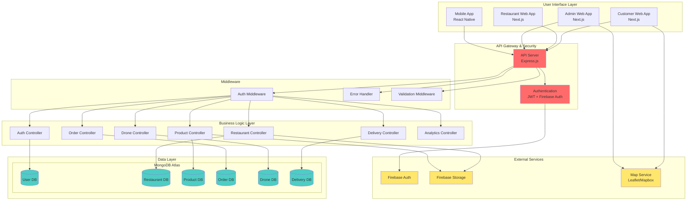
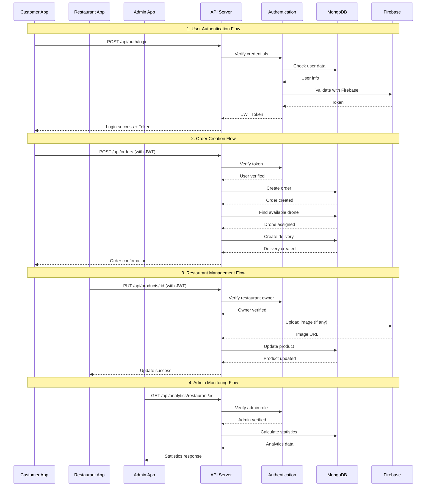
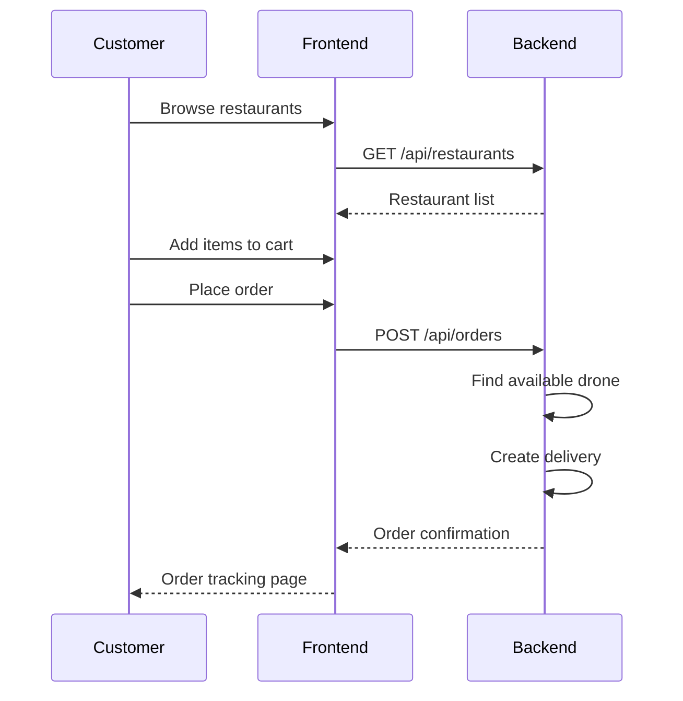
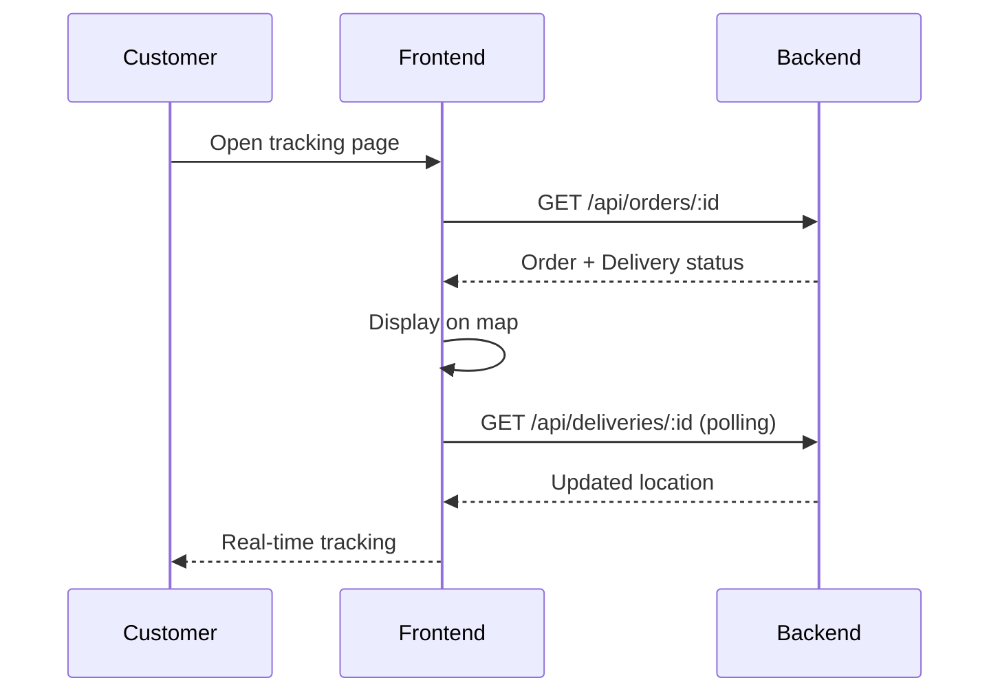

# 🚁 Food Delivery Drone System

Hệ thống giao đồ ăn bằng drone với React/Next.js frontend và Node.js/Express backend.

## ✨ Tính Năng

### Khách hàng (Customer)
- 🔍 Tìm kiếm nhà hàng và món ăn
- 🛒 Thêm món vào giỏ hàng
- 📱 Đặt hàng online
- 🗺️ Theo dõi đơn hàng real-time
- 📜 Xem lịch sử đơn hàng
- ⭐ Đánh giá nhà hàng

### Chủ nhà hàng (Restaurant Owner)
- 🏪 Quản lý thông tin nhà hàng
- 🍔 Quản lý menu (thêm/sửa/xóa món)
- 📊 Xem đơn hàng
- 📈 Báo cáo doanh thu

### Quản trị viên (Admin)
- 👥 Quản lý người dùng
- 🏢 Quản lý nhà hàng
- 🚁 Quản lý đội bay drone
- 📦 Quản lý delivery
- 📊 Dashboard tổng quan
- 🗺️ Fleet map - theo dõi drone real-time

## 🏗️ Kiến Trúc Hệ Thống

### Component Diagram



### Luồng Dữ Liệu Chính



## 🛠️ Công Nghệ Sử Dụng

### Backend
- **Runtime:** Node.js 18+
- **Framework:** Express.js
- **Language:** TypeScript
- **Database:** MongoDB Atlas (NoSQL)
- **Authentication:** JWT + Firebase Auth
- **Validation:** Custom middleware
- **Image Storage:** Firebase Storage

### Frontend
- **Framework:** Next.js 16 (React 19)
- **Language:** TypeScript
- **Styling:** TailwindCSS
- **UI Components:** shadcn/ui
- **State Management:** React Context API
- **Maps:** Leaflet 1.9.4
- **Charts:** Recharts

### DevOps
- **Version Control:** Git
- **Package Manager:** npm/pnpm
- **Process Manager:** nodemon (development)

## 🚀 Khởi Động Nhanh

### Yêu cầu
- Node.js 18+
- npm hoặc yarn
- Firebase Project (với serviceAccountKey.json)

### Cài đặt tự động (Windows)

```powershell
# Chạy script tự động
.\start-all.ps1

# Hoặc dùng batch file
.\start-all.bat
```

### Cài đặt thủ công

#### 1. Clone repository
```bash
git clone https://github.com/VinhHoNguyen/QuangVinh_QuocBao.git
cd QuangVinh_QuocBao
```

#### 2. Cài đặt Backend
```bash
cd Backend
npm install

# Tạo file .env
echo PORT=5000 > .env
echo NODE_ENV=development >> .env
echo JWT_SECRET=your_secret_key >> .env

# Seed dữ liệu
npm run seed

# Chạy server
npm run dev
```

#### 3. Cài đặt Frontend
```bash
cd Web/Client
npm install --legacy-peer-deps

# Chạy frontend
npm run dev
```

#### 4. Truy cập ứng dụng
- **Frontend:** http://localhost:3000
- **Backend API:** http://localhost:5000
- **Health Check:** http://localhost:5000/health

## 🔑 Tài Khoản Test

| Role | Email | Password |
|------|-------|----------|
| Admin | admin@fooddelivery.com | Admin@123 |
| Restaurant Owner | owner1@restaurant.com | Owner@123 |
| Customer | customer1@gmail.com | Customer@123 |

## 📁 Cấu Trúc Project

```
QuangVinh_QuocBao-main/
├── Backend/                 # Node.js/Express API
│   ├── src/
│   │   ├── config/         # Firebase configuration
│   │   ├── controllers/    # Business logic
│   │   ├── middleware/     # Auth, validation, error handling
│   │   ├── models/         # TypeScript types & interfaces
│   │   ├── routes/         # API routes
│   │   ├── scripts/        # Seed & utility scripts
│   │   └── utils/          # Helper functions
│   ├── seed-data/          # JSON data for MongoDB import
│   └── package.json
│
├── Web/
│   ├── Client/             # Next.js Customer App
│   │   ├── app/           # Next.js App Router pages
│   │   ├── components/    # React components
│   │   ├── lib/           # API client, contexts, hooks
│   │   └── package.json
│   │
│   ├── Admin/             # Next.js Admin Dashboard
│   │   └── ...
│   │
│   └── Restaurant/        # Next.js Restaurant Portal
│       └── ...
│
├── Mobile/                # React Native App (optional)
│   └── ...
│
├── start-all.ps1          # PowerShell startup script
├── start-all.bat          # Batch startup script
├── SETUP.md              # Chi tiết hướng dẫn cài đặt
└── README.md             # File này
```

## 📚 API Documentation

### Authentication Endpoints
```
POST   /api/auth/register     - Đăng ký tài khoản
POST   /api/auth/login        - Đăng nhập
GET    /api/auth/profile      - Lấy thông tin user (requires auth)
```

### Restaurant Endpoints
```
GET    /api/restaurants       - Lấy danh sách nhà hàng
GET    /api/restaurants/:id   - Lấy chi tiết nhà hàng
POST   /api/restaurants       - Tạo nhà hàng (owner only)
PUT    /api/restaurants/:id   - Cập nhật nhà hàng (owner only)
DELETE /api/restaurants/:id   - Xóa nhà hàng (owner only)
```

### Product Endpoints
```
GET    /api/products                         - Lấy danh sách sản phẩm
GET    /api/products/:id                     - Lấy chi tiết sản phẩm
GET    /api/products/restaurant/:restaurantId - Lấy sản phẩm theo nhà hàng
POST   /api/products                         - Tạo sản phẩm (owner only)
PUT    /api/products/:id                     - Cập nhật sản phẩm (owner only)
DELETE /api/products/:id                     - Xóa sản phẩm (owner only)
```

### Order Endpoints
```
POST   /api/orders           - Tạo đơn hàng (customer only)
GET    /api/orders           - Lấy danh sách đơn hàng
GET    /api/orders/:id       - Lấy chi tiết đơn hàng
PUT    /api/orders/:id/status - Cập nhật trạng thái đơn hàng
```

### Drone Endpoints
```
GET    /api/drones           - Lấy danh sách drone
GET    /api/drones/:id       - Lấy chi tiết drone
GET    /api/drones/available - Lấy drone available
PUT    /api/drones/:id/status - Cập nhật trạng thái drone (admin only)
```

## 🎯 Use Cases

### 1. Khách hàng đặt hàng


### 2. Theo dõi đơn hàng


## 🗂️ Database Schema

### Collections

#### Users
```typescript
{
  _id: string
  email: string
  name: string
  phone: string
  role: "admin" | "restaurant_owner" | "customer"
  status: "active" | "inactive" | "suspended"
  createdAt: Date
  updatedAt: Date
}
```

#### Restaurants
```typescript
{
  _id: string
  name: string
  phone: string
  address: string
  locationId: string
  image: string
  minOrder: number
  maxOrder: number
  rating: number
  status: "active" | "inactive" | "closed"
  ownerId: string
  createdAt: Date
  updatedAt: Date
}
```

#### Products
```typescript
{
  _id: string
  restaurantId: string
  name: string
  description: string
  price: number
  image: string
  category: "appetizer" | "main_course" | "side_dish" | "dessert" | "drink"
  available: boolean
  createdAt: Date
  updatedAt: Date
}
```

#### Orders
```typescript
{
  _id: string
  userId: string
  restaurantId: string
  items: OrderItem[]
  totalAmount: number
  deliveryAddress: string
  deliveryLocationId: string
  status: "pending" | "confirmed" | "preparing" | "ready" | "picked_up" | "in_transit" | "delivered" | "cancelled"
  paymentMethod: "cash" | "card" | "e-wallet"
  paymentStatus: "pending" | "paid" | "failed"
  createdAt: Date
  updatedAt: Date
}
```

#### Drones
```typescript
{
  _id: string
  code: string
  name: string
  capacity: number
  battery: number
  currentLoad: number
  status: "available" | "busy" | "maintenance" | "offline"
  currentLocationId: string
  createdAt: Date
  updatedAt: Date
}
```

## 🔧 Configuration

### Backend Environment Variables (.env)
```env
PORT=5000
NODE_ENV=development
JWT_SECRET=your_super_secret_jwt_key_change_in_production
FIREBASE_PROJECT_ID=your_firebase_project_id
```

### Frontend Environment Variables (.env.local)
```env
NEXT_PUBLIC_API_URL=http://localhost:5000/api
```

## 🧪 Testing

### Backend API Testing
```bash
# Install dependencies
npm install -g newman

# Run API tests (if postman collection exists)
newman run Backend/postman-collection.json
```

### Manual Testing với curl
```bash
# Health check
curl http://localhost:5000/health

# Get restaurants
curl http://localhost:5000/api/restaurants

# Login
curl -X POST http://localhost:5000/api/auth/login \
  -H "Content-Type: application/json" \
  -d '{"email":"customer1@gmail.com","password":"Customer@123"}'

# Get profile (requires token)
curl http://localhost:5000/api/auth/profile \
  -H "Authorization: Bearer YOUR_TOKEN_HERE"
```

## 🐛 Troubleshooting

### Backend không chạy được
```bash
# Kiểm tra port 5000 có bị chiếm không
netstat -ano | findstr :5000

# Xóa node_modules và cài lại
cd Backend
rm -rf node_modules
npm install
```

### Frontend bị lỗi dependency
```bash
cd Web/Client
rm -rf node_modules package-lock.json
npm install --legacy-peer-deps
```

### Lỗi Firebase
- Kiểm tra file `serviceAccountKey.json` có tồn tại
- Kiểm tra Firebase project ID trong `.env`
- Chạy lại seed script: `npm run seed`

## 📦 Deployment

### Backend (Heroku/Railway/Render)
```bash
# Build
npm run build

# Set environment variables
# PORT, NODE_ENV, JWT_SECRET, FIREBASE_PROJECT_ID

# Start
npm start
```

### Frontend (Vercel/Netlify)
```bash
# Build
npm run build

# Set environment variable
# NEXT_PUBLIC_API_URL=https://your-backend-url.com/api
```

## 🤝 Contributing

1. Fork the repository
2. Create your feature branch (`git checkout -b feature/AmazingFeature`)
3. Commit your changes (`git commit -m 'Add some AmazingFeature'`)
4. Push to the branch (`git push origin feature/AmazingFeature`)
5. Open a Pull Request

## 📄 License

This project is licensed under the MIT License.

## 👥 Authors

- **Quang Vinh** - [GitHub](https://github.com/VinhHoNguyen)
- **Quoc Bao** - [GitHub](https://github.com/...)

## 📞 Support

- **Issues:** [GitHub Issues](https://github.com/VinhHoNguyen/QuangVinh_QuocBao/issues)
- **Email:** support@fooddelivery.com

---

**Made with ❤️ by Quang Vinh & Quoc Bao**
